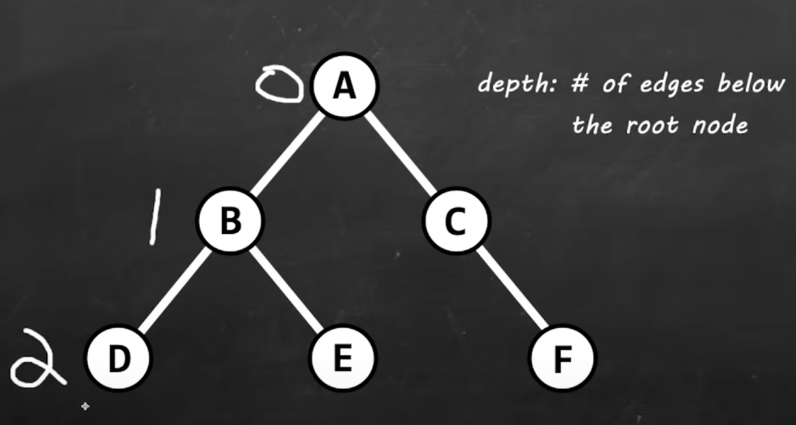

# Notes
The review I am following is in java, I will do all interviews/interview prep in python. I liked this teacher and figured in woudln't hurt to get a little practice using java 

# Overview
### Data Structures
Data structure = a named location that can be used to store and organize data
  * Example 1: A family tree
    * A family tree is a hierarchy of family relationships. We need some way to organize that data. A *tree* is a data structure that can be used
  * Example 2: array
    * An array is a collection of elements stored at contiguous memory locations. We have experience with these from the reviewing python course.

Different data structures have their own way to store and organize data. They each have their own pros and cons. 

### Algorithms
Algorithim = a collection of steps to solve a problem
  * The steps to a solution
  * Example 1: Baking a pizza
    * An algorithim to baking a pizza can be:
      1. Heat the oven
      2. Knead the dough
      3. Add toppings
      4. etc.
  * Example 2: linear search
    * Linear search is a type of algorithm. If you have an array of elements, a linear search would one by one, examine the elements to find a value
    * A linear search is an example of a searching algorithm

### Why learn DS&A?
* You'll write code that is both time and memory efficient
* Commonly asked questions in interviews involve DS&A
    * Ex: reversing a doubly linked list

# Easy Data Structures
## Stacks
Stack = **LIFO data structure. Last-In First-Out**
  * Allows you to store objects into a sort of "vertical tower"
  * push() to add to the top
  * pop() removes objects from the top

Stacks have 5 unique methods
1. .push()
    * Pushes an item to the top of the stack
2. .pop()
    * pops item form top
    * returns the object you pop
3. .peek()
    * View item at the top
4. .empty()
    * View if stack is empty
    * Returns a boolean
5. search()
    * Searches for an item
    * returns position
        * first item has a position of 1
            * remember LIFO structure
        * returns -1 if item is not in stack

Stacks can run out of memory
*  "OutOfMemoryError: Java heap space"


### Uses of Stacks
1. undo/redo features in text editors
2. Moving back/forward through a broswer history
3. Backtracking algorithms (maze, file directories)
4. Calling functions (call stack)


## Queues
Queue = **FIFO data structure. First-In First-Out**
* Ex. a line of people
* A queue is a collection designed for holding elements prior to processing
* Linear data structure
* Concepts of adding/removing
    * Add: Enqueue - add() or offer() 
    * Remove: Dequeue - remove() or poll()

2 classes that implement the queue interface
    * Queue's are interfaces, so they need a DS to implement them
1. LinkedList
    * Using this because it is better for learning. So we will only cover the features that linked lists use via the queue interface
2. PriorityQueue

Queues have 3 unique methods
1. .offer()
    * add to queue (enqueue)
    * aka: .add()
        * .add() will throw an exception
2. .poll()  
    * remove from queue (dequeue)
    * aka: .remove()
    * .poll() will not throw an exception if queue is empty
        * .remove() will throw an exception
3. .peek()
    * view item from queue
    * aka: .element()
        * .elememt() will through an exception

Oher useful methods
* .isEmpty()
    * returns boolean
* .size()
    * returns the size of the queue
* .contains()
    * returns boolean
    * can check to see if a specific item is in the queue

### Uses of Queues
1. Keyboard Buffer (letters should appear on the screen in the order they're pressed)
2. Printer Queue
3. Used in LinkedLists, PriorityQueues, Breadth-first search


## PriorityQueues
Priority Queue = A **FIFO data structure** that serves elements with the highest priorities first. Before elements with lower priority

Uses the same unique methods as a queue described above 
1. .offer()
2. .poll()
3. .peek()

### Uses of Priority Queues
1. Ordering times in a race
2. Hospital patient triage systems where critical patients are seen before less urgent ones
3. Network packet handling critical data (like video calls) gets sent before regular traffic

## ⭐️ArrayLists v. LinkedLists Intro⭐️
### Array Lists
* Arrays are great at randomly accessing elements because they have an index, but not so great at inserting and deleting elements. Especially when the elements are close to the beginning of the array
    * If you have an array of 8 elements and want to insert a new elment into index 3, then the current indeces 3-8 have to be shifted to make space
        * Not that big of a deal with 8 elements, but with 1,000,000 elements it is a big deal
    * The same concept applies with deletion. You need to shift indeces back

### Linked Lists
* Linked lists are great at inserting and deleting elements because you just need to change the address and pointer, but not so great at randomly accessing elements. 
* Linked Lists are made up of a long chain of nodes. Each node contained 2 parts.
    1. Data: Some data we need to store
    2. Address (pointer): An address to the next node in line
    * These nodes are noncontigious. They can be anywhere in my computer's memory
    * It's like a scavenger hunt to the end of the linked list. Each node has a clue (address) to where the next node is. 
    * The last node has an address of null
* Inserting & Deleting
    * To insert a new node you make the new node's address the same as the previous node's address, and change the address of the previous node to the new node's data
    * To delete a node you have the previous node point to the next node in line. No shifitng necesary!
    * *These take constant time*, O(1)
* To locate an element we start at the head and work towards the tail until we find the element we are searching for
    * *Locating a node takes linear time*, O(n)
* I am only explaining a singly linked list, meaning there are single links to each node
* A doubly linked list stores 2 address. One for the next node and one for the previous node in the chain
    * Benefit of a doubly linked list is that you can traverse it head to tail and tail to head 
    * Downside is it takes even more memory than a singly linked list 

## LinkedLists
* LinkedList = stores Nodes in 2 parts (data + address)
    * Nodes are in non-consecutive memory locations
    * Elements are linked using pointers
* The LinkedList class stores the memory locations of the first and last nodes
* The LinkedList class implements 4 interfaces
    1. List
    2. Deque
        * Deque = double ended queue
        * Implements 12 additional methods
            * The methods allow you to add, remove, or peek the head/tail
    3. Cloneable
    4. Serializable
* Can treat a LinkedList like a stack or a queue. We can push, pop, and pull

### Advantages
* Dynamic Data Structure (allocates needed amount of while running)
* Insertion and Deletion of Nodes is easy. O(1) - constant time
* No/Low memory waster

### Disadvantages
* Greater memory usage (additional pointer)
* No random access of elements (no index [i])
* Acessing/searching elements is more time consuming. O(n) - linear time

### Uses of LinkedLists
1. Implement Stacks/Queues
2. GPS navigation
    * Each destination is a node
3. Music playlists
    * Songs can be put in order

## Code Notes for linkedList_vs_arrayList.java
I did a head to head comparing the time it took to run certain methods for an ArrayList and a LinkedList. In most cases an ArrayList was faster. However, if I have to do a lot of inserting or deleting, a LinkedList might be better. But it does seem like an ArrayList is more applicable for most applications.

## Dynamic Array
* Dynamic Array = an array with a resizable capacity
* A.K.A
    1. Java = ArrayList
    2. C++ = Vector
    3. JavaScript = Array
    4. Python: List

### Static Array (side quest)
* Static array has a fixed capacity that we determine at compile time. Normally can't change it later
    * new String[capacity];
* Accessing an element takes O(1) because we have index numbers. The size of the dataset doesn't matter
* Searching for a stored value takes O(n) because we need to iterate through each element until we find the element we want or reach the end
    * Linear time (O(n)) because the larger the data set, the time to finish will increase linerally 
* Inserting/Deleting takes linear time unless done at the end because in that case no shifitng of elements is required. Shifting to add or delete at index 0 takes the longest because then all elements need to be shifted

### Dynamic Array (main quest continued)
* A dynamic array has it's own inner static array with a fixed size. Once the inner static array reaches max capacity, the dynamic array will declare and instantiate a new array with an increased capacity. The size increase of the inner static array varies between 1.5 and 2 depending on the language
    * Growth Factor for each langauge
        * Java ArrayList = 1.5 (3/2)
        * Python PyListObject = -1.125 (n + n >>3)
        * C++ = 1.5 (3/2)
    * new String[capacity *2];
* Once the new inner static array is instantiated we copy the elements onto the new static array. The new static array has different memory addresses than the og array
* If you wish to shrink the capacity you just do the reverse process
* The new inner array has the same methods and pros/cons as a static array

* Use ArrayList class for dynamic arrays
    * Within the class there are a few defined members
        * DEFAULT_CAPACITY = 10;
            * default inital capacity if you do not set one
        * Size
            * Keeps track of how many elements are filled inside the array list

* Created my own basic dynamic for learning called "DynamicArrayClass", but typically would just use ArrayList because it is more efficent and already coded for me.

### Advantages 
1. Random access of elements,  O(1) - constant time
    * Thanks to indexing
2. Good locality of reference and data cache utilization
    * Because the memory address are contiguous, they are right next to each other
3. Easy to insert/delete at the end
    * Because no shifting of elements

### Disadvantages
1. Wastes more memory
    * Adds element memory we might not use
2. Shifting elements is time consuming, O(n) - linear time
3. Expanding/Shrinking the array is time consuming, O(n) - linear time

# ⭐️Big O Notation⭐️
"How code slows as data grows." - Master Shifu

1. *Describes the perforamce of an algorithm as the amount of data increases*
2. Machine independent (# of steps to complete an algorithm)
3. Ignore smaller operations. O(n + 1) -> O(n)

* Examples of Big O Notation
  * O(1)
  * O(n)
  * O(log n)
  * O(n^2)
* n = amount of data (it's a variable like x)

**Visual Examples** 

O(n) - linear time


* If n = 1000000 then it would take ~1000000 steps to complete the function
* This function has a run time complexity of O(n)
    * As the amount of data increases, it will increase the amount of steps, linearly (proportionally)

O(1) - constant time


* This is another way to write the same function as before. 
* If n = 1000000 then it would take 3 steps
* This function has a run time complexity of O(1)
    * The imput size doesn't matter. The amount of data doesn't impact how many steps it takes to return the sum
* The reason it is not O(3) is because we don't care about smaller operations because in the grand scheme of things they don't make much of a difference. So we shorten it to 1 

Big O Notation Diagram

* Time has an * because time does vary depending on machine. Think of it like steps
* O(log n) can be viewed like this: it takes increasingly less time to complete
    * As data size increases, the algorithm will be more and more efficient
* O(n log n) can be viewed like this: in larger data sets it starts to slow down
* O(n^2) is extremely slow in large data sets, but can be faster in small data sets

## Best Case Scenario
When working with large data sets here is the best to worst time complexities
1. O(1)
2. O(log n)
3. O(n)
4. O(n log n)
5. O(n^2)
6. O(n!)
    * Really should never have this

However, it is important to note that some of these runtime complexities are actually faster when working with smaller data sets

# Search Algorithms
## Linear Search
Linear search = iterate through a collection one element at a time

### Run time Complexity
* O(n)

### Disadvantages
* Slow for large data sets

### Advantages
* Fast for searches of small to medium data sets
* Does not need to be sorted
    * Huge benefit over binary searches and interpolation searches
* Useful for data structures that do not have random access (Linked List)

## Binary Search
Binary search = search algorithm that finds the position of a target value within a sorted array or other collection. Half of the array is eliminited during each "step"
* Whatever we are searching through *needs to be sorted*

### Run time Complexity
* O(log n)
    * The algorithm takes increasingly less time to complete the larger the data set
    * Not too efficient when working with small data sets, but fantastic with large data sets


### How the search works
Phase 1
* It always begins in the middle. It checks if the middle value is equal to the target value
* If they are not equal, then we check if the target value is greater than or less than the middle value
    * This is why the collection must be sorted
* Then it discards the half that doesn't matter

Phase 2
* With the newly halfed data, it checks to see if the middle value is equal to the target value
* If they are not equal, then we check if the target value is greater than or less than the middle value
* Then it discards the half that doesn't matter

Phase 3
* Repeats the same process
* If the collection is even, then it rounds down and says that is the middle

### Code Notes
Used built in binary search method of "Arrays" to start, but later built my own binary search function for learning purposes

## Interpolation Search
Interpolation search = improvement over binary search best used for "uniformly" distributed data 
* "guesses" where a value might be based on calculated probe results 
    * if probe is incorrect, search area is narrowed, and a new probe is calculated

Basically we guess where the value will be and return the index. If the guess is incorrect we narrow the search and try again

Really want to emphasize that interpolation searches work REALLY well on *uniformly distributed data*

### Run time Complexity
* average case: O(log (log(n)))
* worst case: O(n) [values in collection increase exponentially]

For practice made my own bubble sort algorithm

# ⭐️ Recursion ⭐️
Recursion = when a thing is defined in terms of itself
* Apply the result of a procedure, to a procedure
* Divide a problem into sub-problems of the same type as the original
* Commonly used with advanced sorting algorithms and navigating trees

*Base case* is what we do when we would like to stop

*Recursive case* is what we do when we would like to continue

Can run out of memory and get a "StackOverflowError"

## Recursion vs Iteration
* A recursive method calls itself. It can be a substitute for iteration
    * Iteration is the repetition of an internal process
    * Recursion is the repetition of a procedure


### Real life example of recursion
The process of creating refreshed sourdough. The recipe calls for some sourdough left over from the last time the same recipe was made

## Advantages
* Easier to read/write
* Easier to debug

## Disadvantages
* Sometimes slower
* Uses more memory

## Call Stack (Side quest)
Programs have a data structure called a call stack. A call stack keeps track of the order in which our program needs to function

### Iterative call stack


* walk method is at the top of the stack and is called once

### Recursive call stack


* walk method is at the top of the stack and is called each step

# Sorting Algorithms
Trying to add more layering. Just did it for this one but will try to remember for the future as well as updating the past

## Bubble Sort 
Bubble sort = pairs of adjacent elements are compared, and the elements swap if they are not in order. Then the next pair of elements are check
* Continue in this pattern until all elements are in order 
* This is really not that efficient of an algorithm even when working with small data sets. In most real world applications this is not the best option, but still a good thing to know
* On a small data set it is okay-ish

### Run time Complexity
O(n^2) - quadratic time
* The larger the data set the more and more inefficient this algo will be

### Space Complexity
O(1) - constant space

## Selection Sort
Selection sort = search through an array and keep track of the minimum value during each iteration. At the end of each iteration, we swap variables.
* On small datasets it is okay
* On large datasets it is bad

### Run time Complexity
O(n^2) - quadratic time
* The larger the data set the more and more inefficient this algo will be

### Space Complexity
O(1) - constant space

## Insertion Sort
Inertion sort = after comparing elements to the left of an index, shift elements to the right to make room to insert a value
* Is preferable to Bubble Sort because it uses less steps. Preferable to Selection Sort because its best case scenario is O(n)
* On small datasets it is decent
* On large datasets it is bad

### Run time Complexity
O(n^2) - quadratic time
* The larger the data set the more and more inefficient this algo will be
* Best case is O(n)

### Space Complexity
O(1) - constant space

## Merge Sort
Merge sort = recursively divide array in 2, sort, re-combine

### Run time Complexity
O(n log(n)) - quasilinear time
* With small datasets it is faster than insertion, selection, and bubble sort
    * It does use more space 

### Space Complexity
O(n) - linear space
* Uses more space than insertion, selection, and bubble sort

## Quick Sort
Quick sort = moves smaller elements to left of a pivot. Recursively divide array in 2 partitions
* Pivot can be at the beginning, middle, or end. Most standard quick sort algorithms set it to the end
    * Trying to find the final resting place for the pivot, where will it be once sorted?
* Once the pivot is in the right spot, the elements to the left should be < the pivot, and elements to the right should be > the pivot. Not necessary in order though
* After pivot is in the right spot, you make 2 partitions (sections). 
    * Partition 1: all elements on the left side of the pivot, not including pivot
    * Partition 2: all elements on the right side of the pivot, not including pivot
* Once you have the 2 partitions, you recursively repeat the procedure on each partition.
    * go up if even

    

Uses 2 indeces: j and i 
* j will begin at the start of the array
    * Checking to see if the value at j is less than the pivot
* i will be 1 less than the beginning of the array
    * If j is < pivot, then you incremet i, then swap the i and j values

### Run time Complexity
Best case: O(n log(n)) - quasilinear time

Average case: O(n log(n)) - quasilinear time

Worst case: O(n^2) - quadratic time
* Rare but happens if array is already sorted

### Space Complexity
O(log(n))
* Due to recursion

# More Data Structures
## Hash Table
Hash table = a data structure that stores unqiue keys to values 
* Format: Entry<K,V>
   * ex. <Integer, String>
* Each key/value pair is known as an Entry
* *Fast* insertion, look up, deletion of key/value pairs
* Not ideal for small data sets, great with large data sets

### Run Time Complexity
Best case: O(1)
* No collisions

Worst case: O(n)
* Only collisions

### Hashing
Hashing = takes a key and computes an integer (formula will vary based on key & data type)
* In a hashtable, we use the hash % capacity to calculate an index number
* key.hashCode() % capacity = index


The hashCode() method will take a key as input, plug it into a formula, and output an integer. This integer is known as a hash
* The formula for a integer key is just the integer itself.
* After finding the hash, you find the remainder of the hashes divided by the size of the hashtable

#### Collision
What if 2 hashes are calculated to be the same value?
* Known as a collision
* Answer: bucketing

Collision = hash function generates the same index for more than one key
* less collisions = more efficiency

#### Bucketing
Bucket = an indexed storage location for one or more Entries
* Can store multiple Entries in case of a collision (linked similarly like a LinkedList)

Each storage location in the hashtable is known as a bucket. The most common solution to a collision is to turn each bucket into a linked list
* This process is known as **chaining**
    * The less collision that there are, the more efficient the hashtable look up will be


To reduce collisions, you can increase the size of the hashtable, but then you use more memory. So you need to find a balance between the 2

### Code Notes
Hashtable's have 3 unique methods
1. .put()
    * Adds an element to the hashtable
2. .get()
    * Allows you to access one of the values
3. .remove()
    * Removes an entry from the hashtable

Other useful functions
* .keySet()
    * To iterate through the hashtable, you can get all the keys from the table and put them in a set. 

# Graphs
Graph = nonlinear aggregation of nodes and edges
* Node (a.k.a Vertex): may contain some piece of data
* Edge: a connection between 2 nodes

If 2 nodes are connection they have *adjacency*

## Undirected Graph


Larry has adjaceny with Patrick and Sandy

Examples:
* Social network: Facebook, strava, etc.
    * Each node could represent a user. If users are friends, we can establish an edge between their nodes

## Directed Graph
Containts edges that will link 1 node to another. These are 1 way connections


Examples: 
* A street map
    * Each node is a destination. Single edges can be 1 way streets and double edges could be 2 way streets

There are 2 popular ways to represent a graph
1. Adjacency Matrix
    * 
    * A 2D array or 2D array list. 1 row and 1 column for each node
    * If there is an edge between 2 nodes, put a 1. If there is not an edge, put a 0
    * Run time complexity: O(1)
    * Space complexity: O(V^2)
        * V = number of vertices that we have
        * Could also be viewed as n
    * Main pro's:
        * Very quick to look up at edge
            * Suites graphs with a lot of edges
    * Main con:
        * It takes up a lot of room
2. Adjacency List
    * 
    * An array or array list of LinkedLists
        * Each element is a separate LinkedList
    * Each header in the LinkedList would contain an address to a node
    * Run time complexity: O(V)
        * V could be viewed as n
    * Space complexity: O(V + E)
        * E is for the number of edges
    * Main pro:
        * Uses less space than a matrix

## Adjacency Matrix
Adjacency Matrix = a 2D array to store 1's/0's to represent edges between nodes
* Number of rows = number of unique nodes
* Number of columns = number of unique nodes

Runtime complexity to check an Edge: O(1)
Space complexity: O(v^2)

## Adjacency List
Adjacnecy list = an array/arraylist of linkedList.
* Each LinkedList has a unique node at the head
* All adjacent neighbors to that node are added to that node's linkedList
    * If we add an edge, we just add the address of that node to the tail

Runtime complexity to check an Edge: O(v)
Space complexity: O(v + e)

# More Search Algorithms
## Depth First Search
Depth First Search (DFS) = a search algorithm for traversing a tree or graph data structure
3 steps
1. Pick a route
2. Keep going until you reach a dead end, or a previously visited node
3. Backtrack to the last node that has unvisted adjacent neighbors

One way to keep track of position is to use a stack. When you visit a node push it to the stack

Can implement DFS iteratively using a stack OR you can use recursion using the call stack

## Breadth First Search
BFS = a search algorithm for traversing a tree or graph data structure
* This is done one "level" at a time rather than one "branch" at a time

To keep track of a position we use a queue. All unvisited nodes we will add to the queue


Each color is a level in this picture

## DFS vs BFS
### DFS
* Traverse a graph branch by branch
* Utilizes a Stack
* Better if destination is on average far from the start
* Children are visted before siblings
* More popular for games/puzzles

### BFS
* Traverse a graph level by level
* Utilizes a Queue
* Better if destination is on average close to start
* Siblings are visited before children

# ⭐️Trees⭐️
tree = a non-linear data structure where nodes are organized in a hierarchy

* The top node of a tree is called the root
    * aka: parents
* The middle nodes of a tree are called branches
    * aka: parent/child
* The bottom nodes of a tree are called leafs
    * aka: child
* Children that share the same parent are called siblings

Examples:
* File explorer
* Databases
* Domain name servers (DNS)
* HTML document object model (DOM)


A subtree is a smaller tree held within a larger tree


* The **size** of the tree is equal to the number of nodes


* The **depth** of a tree is the number of edges below the root node


* The **height** of a tree is the number of edges above the furthest leaf node


## Binary Tree
Binary tree = a tree where each node has no more than 2 children
* A node can have 1 child or 2 children, but no greater than 2


## Binary Search Tree
Binary searrch tree = a tree data strucutre, where each node is greater than it's left child, but less than it's right 
* a binary tree but the values are arranged in a certain order
* Order:
    * The root node should be greater than the left child but less than the right child
    * The subtrees follow the same order
* So, starting from the root node, the leftmost child should be the least value and the rightmost child should be the greatest value.
* This order allows for quick look up


The order in which you insert nodes into a binary search tree does matter if the tree is unbalanced

Unbalanced tree example


Balanced tree example


### Run Time Complexity
Best Case: O(log n)
Worst Case: O(n)
* Time complexity depends on how balanced the tree is

## Tree Traversal
Tree traversal = 
* The process of visiting all the nodes of a tree
    * Because we don't have random access, we need to follow a certain procedure to access all the nodes of a tree

3 different traversal procedures
### 1. In-order
Order: left -> root -> right

Using recursion you visit at many left nodes as you can, followed by the root node, then any right nodes
* When used in the context of a binary search tree, it will visit all nodes in non-decreasing order

Order: D B E A F C G


#### Sample Code
Recursive method that will navigate a tree in order
```java
private void traverseTree(Node root) {
    traverseTree(root.left);
    System.out.println(root.data);
    traverseTree(root.right);
}
```

### 2. Post-order
Order: left -> right -> root

Used to delete a tree from leaf to root
* Goes as far left as it can, then goes right. Goes back up and goes as far right as it can unless it encounters a left

Order: D E B F G C A


#### Sample Code
```java
private void traverseTree(Node root) {
    traverseTree(root.left);
    traverseTree(root.right);
    System.out.println(root.data);
}
```

### 3. Pre-order
Order: root -> left -> right

Used to creat a copy of a tree
* Visit root nodes first, visted each left node until it cannot, then goes right

Order: A B D E C F G


#### Sample Code
```java
private void traverseTree(Node root) {
    System.out.println(root.data);
    traverseTree(root.left);
    traverseTree(root.right);
}
```

# How to get the run time of a program
Code is in runTime.java file

You just subtract the start time from the end time to get duration
